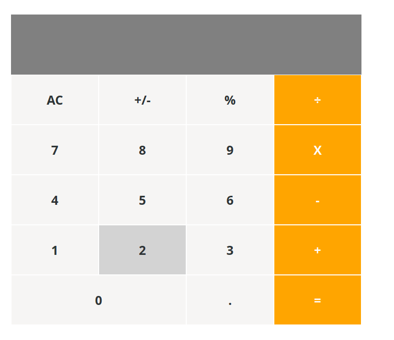

# react_calc
I built a calculator for Math-magicians Inc using create-react-app,

- Basic Calculator
- Users can perform basic calculations with ease

# Screenshot


# Live Demo
[Live Demo Link](https://calcobuild.herokuapp.com) 


# Built With

- HTML 
- CSS
- JAVASCRIPT
- NPM
- REACT
- NODE
- HEROKU
- ESLINT
- STYLELINT
- GITHUB ACTIONS

### Usage
- Clone the project 
```
git clone https://github.com/kelibst/react_calc.git
```
- Run `npm install` to install the local dependencies
- Run `npm start` to launch local development server
- The project should launch in your default browser


## Authors

👤 **Kelly Booster**

- Github: [@kelibst](https://github.com/kelibst)
- Twitter: [@keli_booster](https://twitter.com/keli_booster)
- Linkedin: [Kekeli (Jiresse) Dogbevi
](https://www.linkedin.com/in/kekeli-dogbevi-jiresse/)


# 🤝 Contributing
Contributions, issues and feature requests are welcome!
Feel free to check the issues page

# Show your support
Give a ⭐️ if you like this project!

This project is [MIT](lic.url) licensed.